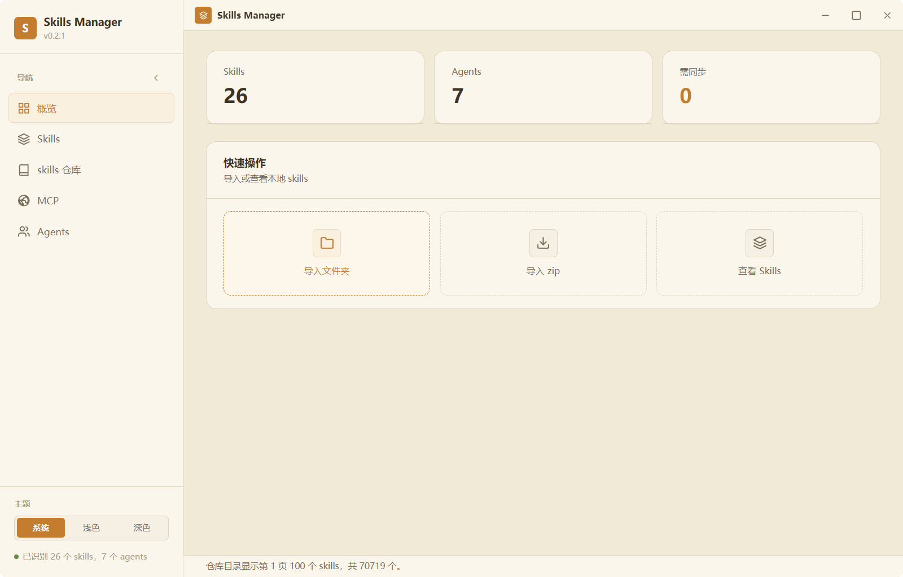

# Skills Manager

[中文文档](README.md)

Skills Manager is a local Windows desktop tool for managing Agent Skills and MCP server configuration across multiple AI clients. It scans local agent directories, compares skill and MCP coverage, installs skills from local files or skills repositories, and helps sync configuration without manually copying folders or editing each config file one by one.

<p align="center">
  
</p>

## Features

- **Skills coverage:** scan local skill directories, group matching skills by title, compare installed and missing agents, choose a source copy, narrow sync targets by Agent tag, sync to selected agents, uninstall from selected agents, mark skills that do not need full coverage, and read `SKILL.md` or README content in the detail dialog.
- **Agent management:** detect and manage Codex, Claude, Claude Code, Claude Desktop Cowork, Cursor, Trae, OpenCode, Cherry Studio, and custom skill directories. The agent preview shows installed and missing skills, can add selected missing skills, can delete selected installed skills from that agent, and can repair Claude Desktop Cowork manifests when needed. Agents can have custom user tags, and those tags appear in the list, preview, editor, and sync-target picker for filtering. Supports custom agents configuration file path.
- **Skill import:** import a skill folder or `.zip` archive and choose target agents with conflict handling.
- **Skills repository:** browse built-in ClawHub, Claude, and Codex sources; search, sort, filter, refresh cached sources, use safety-mode filtering, add custom Git sources, and install skills to selected agents.
- **MCP management:** scan, add, update, enable or disable, sync, and remove MCP servers for Codex, Claude Code, OpenCode, and Trae. Supported transports are `stdio`, `http`, and `sse`. Supports custom MCP configuration file path.
- **Multi-device Skills sync:** every Skill added through Skills Manager first enters `skills/` beside the executable. You may select no agents. Only hub content syncs across devices; each device chooses its own targets. Distribution tries a symlink, then a Windows Junction, then a copy. Independently installed skills with the same name or title remain untouched.
- **External Agent Integration (MCP Server & CLI):** built-in stdio JSON-RPC 2.0 MCP Server (`SkillsManager.exe mcp`) and Windows console CLI for external coding agents (Claude Code, Cursor, Windsurf, Claude Desktop, Antigravity, etc.) to manage skills and MCP servers programmatically. During installation, if target directories are omitted, it prompts with candidate agents and recommends the Universal Hub. One-click registration is available in Settings.
- **Git / GitHub URL Skill & MCP Installation:** inspect GitHub repositories, `/tree/main/...` subdirectories, and local folders for Skills and MCP configuration. Select both kinds from one source and install skills while writing MCP configuration to selected compatible agents. MCP commands still need their runtime dependencies to be available.
- **No-tag filtering:** filter skills and agents lists by "no tag" to quickly locate uncategorized items.
- **Independent view scrolling:** Skills, MCP, and Agents view lists scroll independently, the page no longer scrolls as a whole.
- **Dual Styles & Theme Switching:** provides "Clean Minimal (Modern Blue)" and "Classic Warm (Amber Gold)" visual styles, supporting light mode, dark mode, and system preference with local persistence.
- **Streamlined UI:** removed title bar icon and text, removed bottom status bar, theme switcher moved to the Settings view for a cleaner interface with more content area.

## Tech Stack

- Frontend: React, TypeScript, Vite, Tailwind CSS
- Desktop shell: Tauri 2
- Backend: Rust
- Data handling: local files and local skills repository caches/indexes; sync transport for local directories and S3-compatible endpoints

## Development

Install dependencies:

```powershell
npm install
```

Run the Vite web development server:

```powershell
npm run dev
```

Run the Tauri desktop app in development mode:

```powershell
npm run desktop:dev
```

Build the Tauri app:

```powershell
npm run native:build
```

`npm run native:build` currently runs `tauri build`.

### Central Skills folder

The hub is fixed at `skills/` beside the running `SkillsManager.exe`. Migration accepts only unchanged manager installs confirmed by old records and keeps the originals. Unknown or agent-edited folders stay in place. Existing preview links are registered after their targets are verified. Each device selects targets locally; a newly received Skill stays in that device's hub until selected. Deselecting removes only verified manager distributions. Runtime `skills/` data is excluded from Git.

The executable directory must be writable by the current user. An installation under a protected `Program Files` directory will report an error when creating or changing the hub. Cherry Studio and Claude Cowork use their dedicated install paths; ordinary directory-based agents use links or Junctions when possible, then copy as a fallback.

Run Rust tests:

```powershell
npm run test:rust
```

### Skills sync (Settings)

Configure under **Settings → Skills Sync**:

| Field | Notes |
|-------|--------|
| Endpoint | S3: `http://host:port`; local folder for single-machine tests: `local://D:/path/to/bucket` |
| Bucket | Required for S3; optional for local folders (subdirectory under the endpoint path) |
| Access Key / Secret | S3 only; secret key and encryption password live in the OS keyring, not in `state.json` |
| Encryption password | Must match on every device when encryption is enabled |
| Auto sync | Enables background polling and hub directory watching |

Single-machine verification (no second PC or real S3 required):

```powershell
# Sync-related tests
cargo test --manifest-path src-tauri/Cargo.toml sync_

# Dual-device demo: A publishes → B pulls → conflict → resolve
cargo run --manifest-path src-tauri/Cargo.toml --bin sync_local_demo
```

When running a second desktop instance on the same machine, give it its own data directory (otherwise both processes fight over one `state.json`):

```powershell
$env:SKILLS_MANAGER_DATA_DIR="D:\tmp\skills-manager-device-b"
npm run desktop:dev
```

## External Agent Integration (MCP Server & CLI)

SkillsManager comes with a built-in standard stdio JSON-RPC 2.0 MCP server and Windows console CLI for AI coding agents (such as Claude Code, Claude Desktop, Cursor, Windsurf, etc.) to manage skills and MCP servers programmatically.

### 1. Connecting as an MCP Server

Add to your agent's MCP configuration file:

```json
{
  "mcpServers": {
    "skills-manager": {
      "command": "D:\\path\\to\\SkillsManager.exe",
      "args": ["mcp"]
    }
  }
}
```

*Tip: In Skills Manager desktop UI under **Settings → External Agent Integration**, you can register Skills Manager into detected local agents with a single click.*

**MCP Tools Exposed:**
- `list_agents`: list supported local agents and their skill directories.
- `list_skills`: list installed skills and their agent coverage.
- `inspect_source`: inspect a GitHub/Git URL or local folder for skills and MCP servers.
- `install_skill`: install a skill (pass `target_agent_ids: []` for hub only; omitting the field returns candidate agents for confirmation).
- `uninstall_skill`: uninstall a skill from specified agents.
- `list_mcp_servers`: list configured MCP servers across agents.
- `install_mcp_server`: install an MCP server to target agents.
- `remove_mcp_server`: remove an MCP server from specified agents.
- `sync_skills`: trigger multi-device skills sync.

### 2. CLI Usage

```powershell
# List detected local agents
.\SkillsManager.exe list-agents

# List all discovered skills
.\SkillsManager.exe list-skills

# Inspect a GitHub / Git repository or subpath
.\SkillsManager.exe inspect https://github.com/owner/repo

# Install skills to specified agents
.\SkillsManager.exe install https://github.com/owner/repo --target "<Agent ID copied from list-agents>"

# Save in the hub without distributing
.\SkillsManager.exe install https://github.com/owner/repo -y

# Launch stdio MCP server (invoked by external agents)
.\SkillsManager.exe mcp
```

## Portable Release

Build a Windows portable package:

```powershell
.\scripts\build-portable.ps1
```

The script runs:

```powershell
npm run native:build -- --no-bundle
```

The portable build outputs `src-tauri\target\release\skill-sync-manager.exe`. The `release/` folder's `SkillsManager-v0.4.1-windows-portable.zip` is the release artifact, suitable for uploading to GitHub Releases; the root-level `SkillsManager.exe` is useful for quick local verification.
